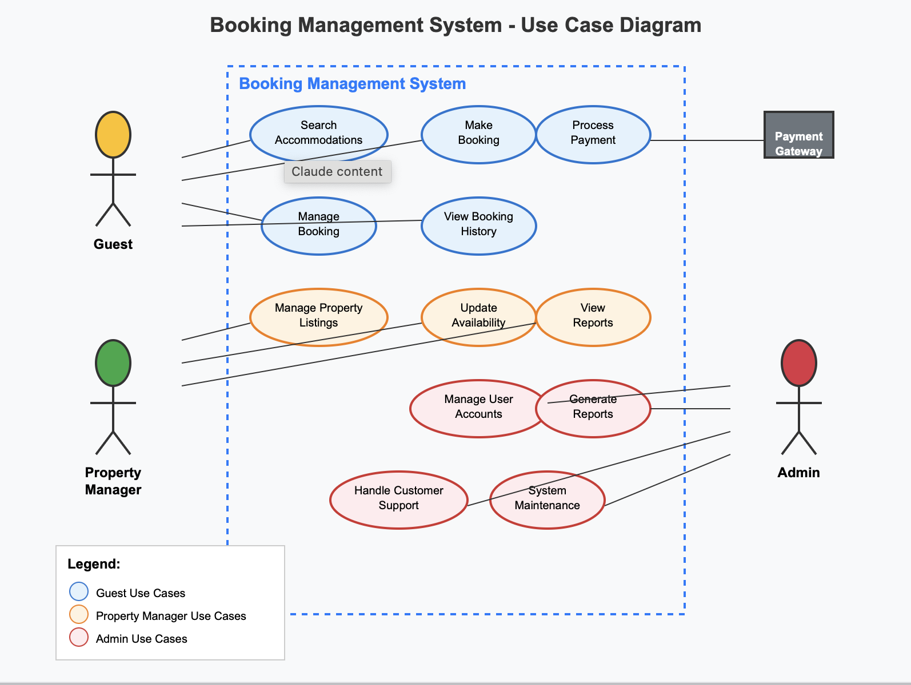

# Requirement Analysis in Software Development

## Introduction

This repository is dedicated to documenting and analyzing the requirements of a Booking Management System. It is part of a practical project designed to simulate a real-world software development scenario, focusing on the crucial phase of requirement analysis in the Software Development Life Cycle (SDLC).

Through this repository, we aim to:

- Identify and document both functional and non-functional requirements.
- Create structured diagrams to visualize system behavior and interactions.
- Establish clear and testable acceptance criteria.
- Apply industry-standard practices in requirement documentation.

This project is structured to enhance skills in organizing project needs into clear, scalable, and maintainable technical documentation — a foundational step for any successful software system.

## What is Requirement Analysis?

Requirement Analysis is a critical phase in the Software Development Life Cycle (SDLC) that involves gathering, understanding, analyzing, and documenting the needs and expectations of stakeholders for a software system. It serves as the foundation upon which the entire project is built, ensuring that the final product aligns with business goals and user requirements.

During this phase, software engineers work closely with clients, users, and other stakeholders to identify what the system should do (functional requirements) and how well it should perform (non-functional requirements). The goal is to translate vague business needs into clear, structured, and actionable documentation that guides the development process.

### Importance in the SDLC

- **Minimizes Risk of Failure:** Clearly defined requirements help prevent misunderstandings that could lead to costly changes or project failure.
- **Ensures Alignment:** It aligns the development team, stakeholders, and end users on a shared vision of the final product.
- **Facilitates Planning:** Well-structured requirements form the basis for project estimation, resource allocation, and scheduling.
- **Supports Testing:** Requirements serve as a benchmark for defining acceptance criteria and validating that the final product meets expectations.
- **Improves Communication:** It creates a common language and understanding among technical and non-technical stakeholders.

In short, Requirement Analysis is essential for delivering software systems that are functional, reliable, and aligned with user needs. It sets the stage for design, development, and testing, making it a cornerstone of successful software projects.

## Why is Requirement Analysis Important?

Requirement Analysis plays a foundational role in ensuring the success of a software development project. It helps align the product with business goals and user expectations, reduces risks, and provides a clear roadmap for the development team.

Here are three key reasons why Requirement Analysis is critical in the Software Development Life Cycle (SDLC):

### 1. Prevents Miscommunication and Scope Creep
Clear and well-documented requirements help ensure that all stakeholders — including clients, developers, designers, and testers — have a shared understanding of what the system should deliver. This minimizes misunderstandings and reduces the chances of unplanned changes or additions (scope creep) during development.

### 2. Provides a Basis for Design, Development, and Testing
Requirement Analysis serves as the blueprint for the entire project. Developers use it to build the system, designers to craft the user experience, and testers to verify that the software behaves as expected. Without accurate requirements, each phase of the SDLC can become disconnected and inefficient.

### 3. Improves Project Planning and Estimation
Well-defined requirements make it easier to estimate project timelines, allocate resources, and identify potential risks early. This leads to better project management and helps teams deliver software on time and within budget.

By establishing a clear foundation early in the SDLC, Requirement Analysis significantly increases the chances of delivering a high-quality, user-centered software solution.

## Key Activities in Requirement Analysis

Requirement Analysis involves several structured activities that help transform stakeholder needs into detailed and actionable specifications. Below are the five key activities typically involved in this phase:

- **Requirement Gathering**  
  This is the initial step where relevant information is collected from stakeholders, including clients, users, and subject matter experts. The goal is to understand what the stakeholders expect from the system.

- **Requirement Elicitation**  
  Elicitation involves actively engaging stakeholders through techniques such as interviews, surveys, workshops, brainstorming sessions, and observation to uncover hidden, implicit, or unclear requirements.

- **Requirement Documentation**  
  Once gathered and elicited, requirements must be clearly documented in an organized format. This includes writing functional and non-functional requirements, use cases, and user stories, usually in structured markdown or formal documents.

- **Requirement Analysis and Modeling**  
  In this step, the documented requirements are analyzed for completeness, consistency, and feasibility. Visual models like use case diagrams, flowcharts, and data flow diagrams may be created to represent system behavior and interactions more clearly.

- **Requirement Validation**  
  This final step ensures that the documented requirements accurately reflect stakeholder expectations and are technically feasible. Validation is done through reviews, walkthroughs, and approvals to confirm that the system built from these requirements will meet business goals.

These activities are essential for producing a reliable roadmap for the design and development phases of a software project.

## Types of Requirements

In software development, requirements are generally categorized into two main types: Functional Requirements and Non-functional Requirements. Both are crucial to building a system that not only works as intended but also performs efficiently and meets user expectations.

### Functional Requirements

Functional Requirements define **what the system should do**. They describe the system's behavior, features, and interactions in response to specific inputs or situations.

#### Examples for the Booking Management System:
- Users can create an account and log in.
- The system allows customers to search for available rooms or services based on date and location.
- Admins can add, update, or delete booking records.
- Users can cancel or modify existing bookings.
- The system sends confirmation emails after a successful booking.

### Non-functional Requirements

Non-functional Requirements specify **how the system should perform**. They include constraints, quality attributes, and performance benchmarks that do not relate to specific functionalities but affect the user experience and system reliability.

#### Examples for the Booking Management System:
- The system should be able to handle up to 10,000 concurrent users.
- All booking transactions must be secured using HTTPS and encrypted data storage.
- The platform should have 99.9% uptime availability.
- Response time for search queries should not exceed 2 seconds.
- The application should be accessible via desktop and mobile devices.

Understanding both types of requirements helps ensure the system is both **functionally correct** and **practically usable**, making the software robust, secure, and user-friendly.

## Use Case Diagrams

Use Case Diagrams are a visual modeling tool used in Requirement Analysis to represent the interactions between users (actors) and the system. They help identify the functionalities (use cases) the system must support and who will interact with those functionalities.

### Benefits of Use Case Diagrams:
- Clarify system functionality from the user's perspective.
- Help identify key actors and their goals.
- Serve as a communication tool between technical and non-technical stakeholders.
- Support the validation and refinement of system requirements.

### Use Case Diagram: Booking Management System

The diagram below represents the main use cases and actors involved in a typical booking management system:

## Acceptance Criteria

Acceptance Criteria are a set of predefined conditions that a software product or feature must meet to be accepted by users, clients, or stakeholders. They are used to determine whether a specific requirement or functionality has been successfully implemented.

### Importance of Acceptance Criteria in Requirement Analysis:

- **Clarifies Expectations**: Defines exactly what is required for a feature to be considered complete.
- **Ensures Testability**: Acceptance criteria serve as the foundation for writing test cases and verifying functionality.
- **Reduces Ambiguity**: Helps prevent misunderstandings between stakeholders and developers by clearly stating the expected behavior.
- **Guides Development**: Provides a clear, measurable target that developers can aim for during implementation.
- **Supports Validation**: Makes it easier to confirm whether business needs and user requirements have been fulfilled.

### Example: Acceptance Criteria for the Checkout Feature

**Feature**: Checkout Booking

**Acceptance Criteria:**

1. ✅ The user must be logged in to proceed to checkout.
2. ✅ The system must display a summary of selected booking details, including dates, location, and price.
3. ✅ The user can select a payment method (credit card, PayPal, etc.).
4. ✅ The payment must be securely processed via a third-party payment gateway.
5. ✅ Upon successful payment, the system must generate a booking confirmation and send it to the user’s registered email.
6. ✅ If the payment fails, the user must receive an appropriate error message and be allowed to retry.
7. ✅ All data must be saved securely and be retrievable for future reference by the user and the admin.

Acceptance Criteria ensure that each feature is built to meet business goals and user expectations while remaining testable and trackable.
